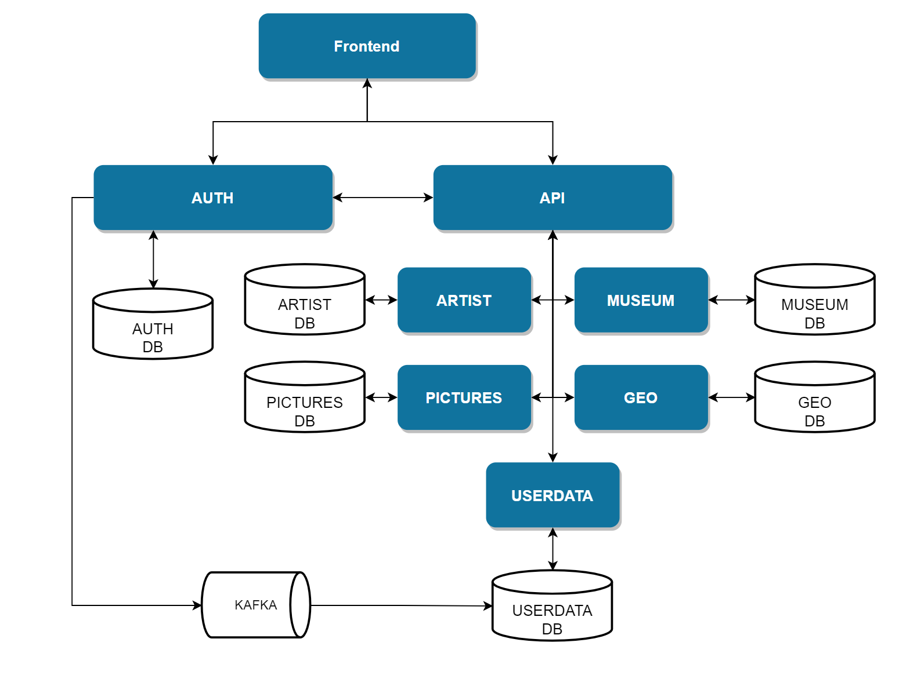

### Rococo - микросервисное приложение, которое состоит из нескольких сервисов:

- rococo-client - frontend приложения
- rococo-auth - модуль авторизации
- rococo-api - модуль проксирования запросов от клиента к сервисам приложения
- rococo-artist - модуль управления художниками
- rococo-museum - модуль управления музеями
- rococo-pictures - модуль управления картинами
- rococo-userdata - модуль управления данными пользователя
- rococo-geo - модуль управления странами

### Схема взаимодействия сервисов Rococo



## Алгоритм запуска приложения

### 1. Запустить базу данных, kafka и zookeeper необходимо выполнить команду

```posh
$ bash localenv.sh
```

### 2. Запустить frontend проекта, для этого нужно перейти в каталог

```posh
$ cd ./rococo-client
```

Обновить зависимости

```posh
$ npm i
```

и запусть фронт с помощью команды

```posh
$ npm run dev
```
Фронт стартанет в твоем браузере на порту 3000: http://127.0.0.1:3000/

### 3. Запустите модуль авторизации rococo-auth

```posh
./gradlew :rococo-auth:bootRun --args='--spring.profiles.active=local'
```

### 4. Далее в произвольном порядке запустите оставшиеся сервисы

```posh
./gradlew :rococo-api:bootRun --args='--spring.profiles.active=local'
./gradlew :rococo-artist:bootRun --args='--spring.profiles.active=local'
./gradlew :rococo-geo:bootRun --args='--spring.profiles.active=local'
./gradlew :rococo-museum:bootRun --args='--spring.profiles.active=local'
./gradlew :rococo-pictures:bootRun --args='--spring.profiles.active=local'
./gradlew :rococo-userdata:bootRun --args='--spring.profiles.active=local'
```


