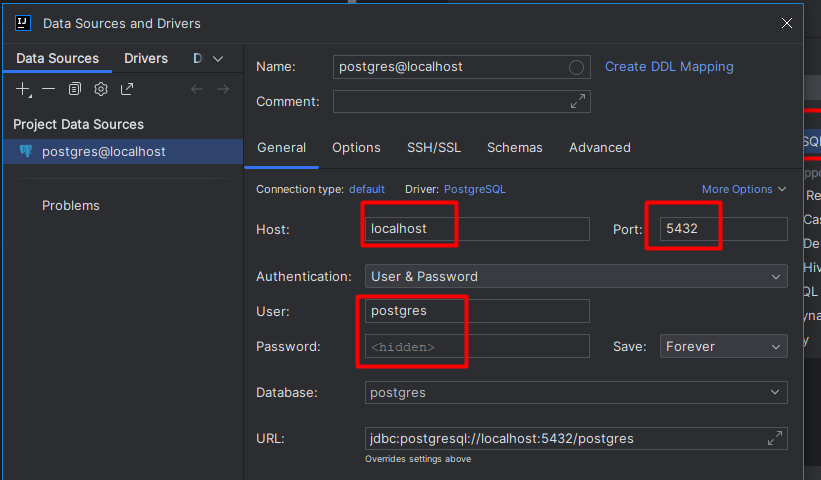

### Rococo - микросервисное приложение, которое состоит из нескольких сервисов:

- rococo-client - frontend приложения
- rococo-auth - модуль авторизации
- rococo-api - модуль проксирования запросов от клиента к сервисам приложения
- rococo-artist - модуль управления художниками
- rococo-museum - модуль управления музеями
- rococo-pictures - модуль управления картинами
- rococo-userdata - модуль управления данными пользователя
- rococo-geo - модуль управления странами

### Схема взаимодействия сервисов Rococo


## Алгоритм запуска приложения

### 1. Создай volume для сохранения данных из БД в docker

```posh
docker volume create pgdata
```

### 2. Запусти базу данных, kafka и zookeeper необходимо выполнить команду

```posh
$ bash localenv.sh
```

### 3 Создай подключение к базе данных

Выбери в меню раздел Database -> New (+) -> Data source -> PostgreSQL


В окне настроек введи данные в поля
host:localhost,
port:5432,
user:postgres,
password:secret



### 4. Создай БД для сервисов:

Для этого в Database -> New (+) -> Query Console выполни:
```posh
create database "rococo-auth" with owner postgres;
create database "rococo-artist" with owner postgres;
create database "rococo-geo" with owner postgres;
create database "rococo-museum" with owner postgres;
create database "rococo-pictures" with owner postgres;
create database "rococo-userdata" with owner postgres;
```

### 5. Заполни БД rococo-geo данными:

Для этого выполни sql запрос из файла

```posh
resources/db.migration/V1__Initail_Schema.sql
```

в консоли должна быть выбрана схема rococo-geo.public


### 6. Запусти frontend проекта, для этого нужно перейти в каталог

```posh
cd ./rococo-client
```

Обновить зависимости

```posh
npm i
```

и запусти фронт с помощью команды

```posh
npm run dev
```

Фронт стартанет на порту 3000: http://127.0.0.1:3000/

### 7. Запусти модуль авторизации rococo-auth

При запуске в Intellij Idea предварительно нужно указать Active profile=local


либо запустить с помощью команды в терминале

```posh
./gradlew :rococo-auth:bootRun --args='--spring.profiles.active=local'
```

### 8. Далее в произвольном порядке запусти оставшиеся сервисы

При запуске в Intellij Idea предварительно нужно указать Active profile=local
либо запустить с помощью команды в терминале

```posh
./gradlew :rococo-api:bootRun --args='--spring.profiles.active=local'
./gradlew :rococo-artist:bootRun --args='--spring.profiles.active=local'
./gradlew :rococo-geo:bootRun --args='--spring.profiles.active=local'
./gradlew :rococo-museum:bootRun --args='--spring.profiles.active=local'
./gradlew :rococo-pictures:bootRun --args='--spring.profiles.active=local'
./gradlew :rococo-userdata:bootRun --args='--spring.profiles.active=local'
```

### 9. Запустить тесты

Для этого кликнуть правой клавишей по папке test

```posh
rococo-e2e-tests/src/test/java/guru/qa/rococo/test
```

и выбрать Run test, как показано на скришоте:


Результат выполнения тестов


## Запуск тестов в докере

### 1. Прописать в etc/hosts алиасы для Docker

```posh
##
# Host Database
#
# localhost is used to configure the loopback interface
# when the system is booting.  Do not change this entry.
##
127.0.0.1       localhost
127.0.0.1		front.rococo.dc
127.0.0.1		auth.rococo.dc
127.0.0.1		api.rococo.dc
127.0.0.1		allure
127.0.0.1		selenoid
```

### 2. Запустить сервис с помощью команды

```posh
bash docker-compose-e2e.sh
```

Сервис будет доступен по адресу http://front.rococo.dc


